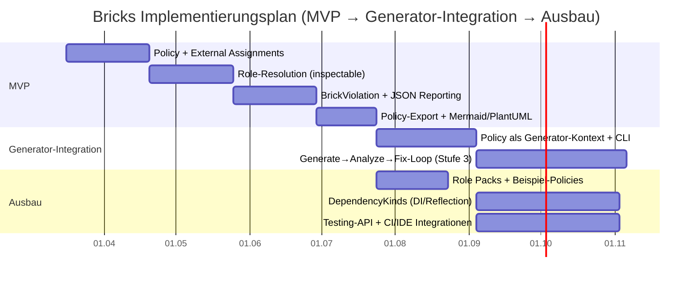
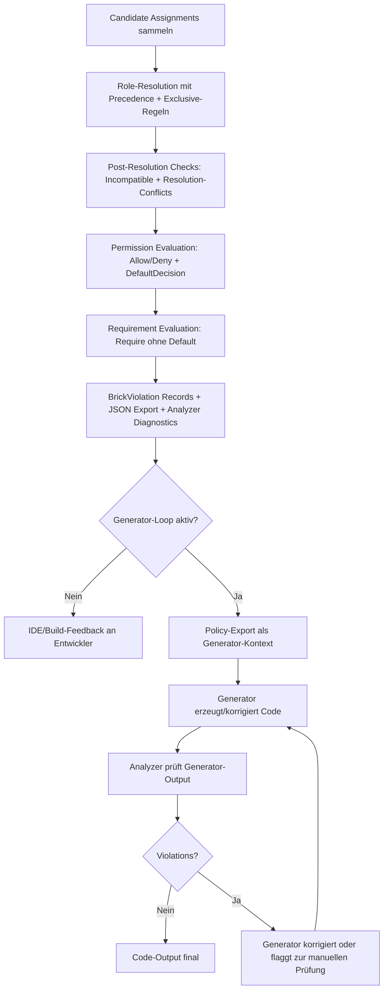

# Konzeptanalyse von NMolecules.Bricks

Revision: März 2026 — Review-Punkte eingearbeitet (Entscheidungsempfehlung,
Informationslücken-Priorisierung, Timeline-Annahmen, KPI-Reifegradkalibrierung,
Scope-Creep-Gegenmassnahme, Generic-Attributes-Verortung, Architekturtests-
Trade-off); neu: Bricks als Sicherheitsnetz für KI-generierten Code.

---

## Executive Summary

Das vorliegende Konzeptdokument beschreibt **NMolecules.Bricks** als strukturelles
**Role-and-Rule-Framework** für .NET-Codebasen: Code-Artefakte werden **semantisch
klassifiziert** (Rollen), Regeln prüfen **Beziehungen/Abhängigkeiten** zwischen
Rollen **deterministisch**, und Verstösse sollen konsistent in **Analyzer, Build,
Tests und Reports** sichtbar werden.

Die konzeptionelle Stärke liegt in einem ungewöhnlich klaren Meta-Modell
(Elemente → Rollen → Assignments/Resolution → Rules/Policies → Violations)
inklusive expliziter **Precedence-Logik**, Trennung von **Allow/Deny** vs.
**Require** sowie einer geplanten, matrixbasierten Evaluation.

Die grössten Umsetzungsrisiken sind praktisch: **Adoption/Ergonomie**
(Rollenmodellierung, Noise/False Positives, Governance um DefaultDecision),
fehlende produktreife **Policy-/Config-/Reporting-Surfaces** sowie technisch
schwierige Dependency-Arten wie DI/Reflection, die teils nicht compile-time
sichtbar sind.

**Empfehlung: MVP-Schiene priorisieren.** Konkret: External Assignments +
inspectable Role-Resolution + standardisierte Violation Records +
Reporting/Exports als geschlossene Liefereinheit, bevor komplexere
DependencyKinds angegangen werden. Diese Reihenfolge minimiert das
Einführungsrisiko bei maximalem Nutzwert pro Engineering-Woche — und schafft
gleichzeitig die Grundlage für einen neuen, wachsenden Anwendungsfall: Bricks
als **deterministisches Sicherheitsnetz für KI-generierten Code**, bei dem
weder Programmierer noch Code-Generator stillschweigend Schichtgrenzen verletzen
dürfen.

Die Konsequenz dieser Entscheidung: Ressourcen und Scope für Phase 1 müssen
explizit abgegrenzt werden. Alles was über External Assignments, Resolution,
Violations und einen Basis-Export hinausgeht — insbesondere DI/Reflection,
Generator-Integration und erweiterte Role Packs — ist bewusst Phase 2.

### Status gegenüber älteren Review-Punkten

Die Foundations-Revision vom 14. März 2026 hat mehrere frühere
Konzeptkritikpunkte bereits geschlossen:

- Role Resolution ist jetzt explizit, deterministisch und kombinierungsbewusst
- `Require` ist klar von Permission-Evaluation getrennt
- `Scope` ist als eigener Teil des Modells definiert
- Violations sind als normalisierte, stufenübergreifende Records modelliert
- Precedence ist kein unscharfer Integer-Priority-Mechanismus mehr

Offen bleiben vor allem operative und dokumentationsbezogene Punkte:

- External Assignments, Reporting und Exporte sind weiter Zielmodell-Lücken
- DI und Reflection bleiben in V1 absichtlich nur teilweise abdeckbar
- Performance-Budgets, Rollout-Modi und Governance sind noch nicht als
  verbindliche Projektstandards festgelegt
- einzelne Layer-2-/Use-Case-Dokumente müssen noch auf die neue Foundation als
  Autoritätsquelle synchronisiert werden

---

## Kontext & Annahmen

### Kontext

Das „Bricks Foundational Concept" (Revision 14. März 2026) wird als primäres
Spezifikationsdokument behandelt. Bricks wird als **Tech/System-Design** mit
Produkt- und Governance-Komponenten bewertet: ein Tooling-/Framework-Ansatz
zur Durchsetzung architektureller Grenzen in .NET-Systemen, typischerweise
über statische Analyse (IDE/Build) und ergänzende Reporting-/Testpfade.

In der Forschung werden Abweichungen zwischen intendierter und implementierter
Architektur als **Architecture Drift/Erosion** beschrieben; automatisierte
Conformance-Prüfungen zielen auf genau dieses Problemfeld.

### Zusammenfassung der verfügbaren Informationen

Es liegt genau **ein** umfassendes Primärdokument vor. Weitere Artefakte
(Repo, API-Doku, Roadmap, reale Analyzer-Outputs, Benchmarks, Nutzerfeedback)
sind nicht Teil der Unterlagen.

**Was das Dokument liefert:**
- Zweck & Prinzipien: Semantik vor Syntax, Legacy adressierbar, .NET-Realität
  modellieren, Determinismus als Muss.
- Ist-Stand: RoleAttribute/RoleAliasAttribute, RuleAttribute + Filter, IDs,
  Messages, konkrete Analyzer-Diagnostics, Member-Cardinality-Contracts.
- Lücken: BrickElement als erstklassiges Record, externe Role-Assignments,
  formale Role-Resolution-Resultate, DependencyKinds wie DI/Reflection,
  Policies/Matrix, standardisierte Violations, Reporting/Export.
- Ziel-Metamodell: BrickElement, BrickRole, BrickRoleAssignment inkl.
  Precedence, BrickDependency, BrickRule/Policy, BrickViolation, Scope-Modell,
  Evaluation-Pipeline, Matrix-Ansatz, Role Packs.

### Informationslücken — Blocking vs. Enriching

Nicht alle Informationslücken sind gleich. Für die Entscheidung MVP vs.
Vollausbau sind folgende Lücken **blocking** — ohne sie kann keine belastbare
Planung erfolgen:

- **Zielumgebung (blocking):** Grösse/Komplexität der Codebasis, Anteil Legacy,
  Build-/CI-Setup. Ohne das ist keine Timeline-Schätzung vertretbar.
- **Performance-Budget (blocking):** Tolerierbarer Analyzer-Overhead in IDE und
  Build. Bestimmt direkt, wie komplex die Resolution-Engine in V1 sein darf.
- **KI-Codegenerator-Toolchain (blocking für AI-Safety-Net-Szenario):**
  Welche Generatoren werden eingesetzt (GitHub Copilot, Cursor, benutzerdefiniert)?
  Wie integrieren sie sich in den Build? Ohne das kann die Generator-Feedback-
  Schleife nicht designed werden.

Folgende Lücken sind **enriching** — nützlich, aber die Empfehlung ändert sich
nicht:

- Operative Evidenz (False Positives in Pilotprojekten, Baseline-Volumen)
- Lizenzierung und Distribution
- Spezifische Compliance-Anforderungen
- Nutzerfeedback aus bestehenden Analyzer-Deployments

---

## Kernanalyse

### Kernannahmen

Bricks basiert auf folgenden tragenden Annahmen:

1. **Rollen sind das semantische Modell**, nicht Namespaces/Folders.
2. **Legacy muss ohne Voll-Refactor klassifizierbar sein**, daher externe/
   indirekte Zuweisungen (Config, Convention, Inference, Alias).
3. **.NET-Realität ist Teil der Wahrheit** (Assemblies, internal/
   InternalsVisibleTo, Generated, Partial Types, DI, Reflection).
4. **Determinismus**: gleiche Inputs ⇒ gleiche Resolution + gleiche Violations.
5. **Policy-Default ist sicherheitsrelevant** (Allow = „open", Deny = „closed");
   muss explizit sein.

Eine sechste Annahme wird durch den AI-Codegenerator-Anwendungsfall hinzugefügt:

6. **Generierter Code ist kein Sonderfall**, sondern ein gleichwertiger
   Erzeuger von Architekturverletzungen. Ob ein fehlerhafter Schichtzugriff
   vom Programmierer oder vom Code-Generator stammt, ist für die Policy
   irrelevant. Die strukturelle Verletzung ist dieselbe und muss gleich
   behandelt werden.

### Ziele

Dokumentiertes Ziel ist ein stabiler konzeptioneller Referenzrahmen für
API-Design, Analyzer-Wachstum, Testing, Reporting und IDE-Integrationen.
Operativ soll Bricks: semantisch klassifizieren, Rollen zuweisen, Regeln
zwischen Rollen deklarieren, Beziehungen deterministisch validieren und
Violations konsistent ausgeben.

### Zielgruppen und primärer Adopter

Drei Zielgruppencluster sind relevant:

- **Architekt:innen/Plattformteams**: definieren Rollenfamilien, Policies,
  DefaultDecision, Role Packs; verantworten Governance.
- **Entwickler:innen in Produktteams**: erhalten Feedback über Analyzer in
  IDE/Build; steuern Severity/Regeln via EditorConfig.
- **QA/Engineering Enablement**: integrieren in CI, bauen Reports/Exports,
  definieren Rollout-Muster.

**Primärer Adopter und kritisches Ersterlebnis:** Die Entscheidung welcher
Cluster zuerst bedient wird, bestimmt die MVP-Prioritäten. Zwei realistische
Szenarien:

**Szenario A — Tech Lead mit Legacy-Codebasis:** Ziel ist schnelle
Klassifikation ohne Refactoring. Kritische Voraussetzung: External Assignment
via Config ohne Attributpflicht. Kritisches Ersterlebnis: "Ich sehe in unter
30 Minuten eine Role Map meiner bestehenden Codebasis."

**Szenario B — Team mit aktivem KI-Code-Generator-Einsatz:** Ziel ist
deterministischer Schutz gegen Schichtgrenzenverletzungen, die der Generator
einschleppt. Kritische Voraussetzung: Analyzer läuft im Build des generierten
Codes und liefert Violations bevor der Code committed wird. Kritisches
Ersterlebnis: "Der Generator hat eine Violation produziert, ich sehe sie
sofort in der IDE."

Beide Szenarien priorisieren unterschiedliche MVP-Bausteine. Szenario A
verlangt Config-basiertes Assignment. Szenario B verlangt einen stabilen,
performanten Analyzer mit klarem Scope-Modell. Diese Entscheidung sollte
vor der MVP-Finalisierung getroffen werden.

### Erfolgskriterien

- **Role-Coverage**: Anteil Elemente mit EffectiveRoles nach Resolution.
- **Erklärbarkeit**: CandidateAssignments/SuppressedAssignments/Conflicts
  sind inspectable.
- **Deterministische, stabile Findings**: reproduzierbar in IDE und CI.
- **Niedriger Noise**: Unterdrückungen/Severity sind steuerbar und werden
  nicht zum Normalfall.
- **Wirksames Gating (optional)**: kritische Verstösse können Builds/PRs
  blockieren.
- **Generator-Konformität (neu)**: Anteil generierter Commits ohne neue
  Schichtverletzungen — als Qualitätskennzahl für den Generator-Feedback-Loop.

---

## SWOT

| Stärken | Schwächen |
|---|---|
| Sehr klares Meta-Modell (Element/Rolle/Assignment/Dependency/Rule/Policy/Violation) inkl. formaler Pipeline. | Zielbild ist gross; ohne opinionated Defaults droht Overhead (Rollen-/Regel-Explosion). |
| Deterministische Resolution durch explizites Precedence-Modell (Specificity + Authority) und sichtbare Konflikte. | Externe Assignments/Exports/Reporting sind als Gap benannt, aber noch nicht erstklassig. |
| Saubere Trennung Permission (Allow/Deny) vs. Requirement (Require) mit eigener Semantik und ohne Default-Fallback bei Require. | DI/Reflection als DependencyKinds sind konzeptionell wichtig, aber technisch schwierig (nicht immer compile-time sichtbar). |
| Scope-Modell (Global/Assembly/Namespace/Type/Member) ist klar und für Reporting gut nutzbar. | DefaultDecision ist sicherheitsrelevant; Teams müssen „open vs. closed" verstehen und konsistent anwenden. |
| **Neu: natürliche Eignung als Sicherheitsnetz für KI-generierten Code** — deterministisch, policy-getrieben, IDE-integriert. | **Neu: Generator-Feedback-Loop ist nicht im Konzept ausgearbeitet** — weder als Architektur noch als API. |

| Chancen | Risiken |
|---|---|
| Reife Tooling-Erwartung im Markt: Architektur-Drift-Erkennung, Visualisierung, Quality Gates sind etablierte Bedürfnisse. | Akzeptanzrisiko durch Noise/False Positives: Wenn Findings nicht handhabbar sind, wird das Tool deaktiviert oder unterdrückt. |
| Roslyn-Analyzer Ökosystem ermöglicht „Shift Left" (Design-Time + Build) mit zentraler Konfiguration. | Wettbewerb: etablierte Tools bieten Reporting/DSM/Trend/Gating „out of the box". |
| Source Generators können externe Policy-Dateien einlesen und Analyzer-sichtbare Artefakte generieren (Bridge für Legacy/DI). | Scope Creep: wenn Bricks gleichzeitig Policy Engine + Analyzer + Generator + Reporting-Plattform sein will, steigt das Delivery-Risiko erheblich. **Gegenmassnahme: explizite MVP-Definition als versionierter Entscheid (ADR), Feature-Freeze-Kriterium pro Phase, keine Phase-2-Themen in Phase-1-Planung.** |
| **Neu: KI-Coding-Assistenten** (Copilot, Cursor, benutzerdefinierte Generatoren) erzeugen strukturell inkonsistenten Code im industriellen Massstab — Bricks kann hier als einziges deterministisches Korrektiv wirken. | **Neu: Generator-Integration erfordert definierte Feedback-Kanäle** (MCP, CLI, API) — ohne das bleibt der Generator-Anwendungsfall konzeptuell, aber nicht lieferbar. |

---

## Bricks als Sicherheitsnetz für KI-generierten Code

Dies ist ein eigenständiger Anwendungsfall, der über die klassische
Architekturdrift-Erkennung hinausgeht und das Konzept in einen aktuellen
Kontext stellt.

### Das Problem

KI-Coding-Assistenten und Code-Generatoren (GitHub Copilot, Cursor,
benutzerdefinierte LLM-Pipelines) erzeugen funktional korrekten Code, der
strukturell falsch sein kann: falsche Schichtzugriffe, verbotene
Abhängigkeiten, Rollenverletzungen, Seiteneffekte durch unkontrollierte
DI-Registrierungen. Der Generator "weiss" nicht, welche Policies für die
Zielcodebasis gelten. Und der Programmierer, der den generierten Code akzeptiert,
überprüft typischerweise Funktionalität, nicht Architekturkonformität.

Das Ergebnis ist strukturelle Erosion im industriellen Massstab — schneller
als jede manuelle Code-Review-Kapazität verarbeiten kann.

### Bricks als Korrektiv

Bricks ist für diesen Anwendungsfall konzeptionell gut positioniert:

- **Deterministisch**: gleiche Policy + gleicher Code = gleiche Violations,
  unabhängig davon ob der Code von Mensch oder Generator stammt.
- **IDE-integriert**: Violations erscheinen sofort beim Akzeptieren von
  generiertem Code, bevor ein Commit erfolgt.
- **Rollenbasiert**: die Policy beschreibt strukturelle Absicht in maschinenlesbarer
  Form — genau das Format, das ein Generator konsumieren kann.

### Drei Integrationsstufen

**Stufe 1 — Passiver Schutz (V1-fähig):**
Der Analyzer läuft wie gewohnt. Generierter Code wird wie manuell geschriebener
Code behandelt. Violations erscheinen in IDE und Build. Der Generator hat keinen
Zugriff auf Policies. Das ist der Minimalfall und erfordert keine
Generator-spezifische Arbeit.

**Stufe 2 — Policy-Export für Generator-Kontext (Phase 2):**
Bricks exportiert die aktiven Policies in einem maschinenlesbaren Format
(JSON, strukturiertes Markdown), das als Kontext-Prompt oder System-Prompt an
den Generator übergeben wird. Der Generator "kennt" damit die Rollenstruktur
und kann Schichtverletzungen im generierten Code von vornherein vermeiden.

Konzeptskizze eines Policy-Exports als Generator-Kontext:

```json
{
  "roles": ["DomainLayer", "ApplicationLayer", "InfrastructureLayer"],
  "rules": [
    {
      "description": "DomainLayer must not depend on InfrastructureLayer",
      "sourceRole": "DomainLayer",
      "targetRole": "InfrastructureLayer",
      "decision": "Deny"
    }
  ],
  "defaultDecision": "Deny"
}
```

**Stufe 3 — Aktive Selbstprüfung und Policy-Erweiterung (Phase 3):**
Der Generator erhält nach dem Generieren Feedback aus dem Bricks-Analyzer
(via MCP-Tool, CLI-Aufruf oder strukturiertem API-Output) und kann:

- den generierten Code korrigieren bevor er ausgegeben wird
  ("Generate → Analyze → Fix → Output"-Loop)
- neue Rollenmuster erkennen, die in der bestehenden Policy nicht beschrieben
  sind, und Policy-Erweiterungsvorschläge erzeugen ("Ich habe wiederholt
  Elemente mit Muster X erzeugt — soll ich dafür eine neue Rolle vorschlagen?")

Dieser Feedback-Loop macht Bricks zu einem aktiven Bestandteil des Generator-
Workflows, nicht nur zu einem passiven Prüfinstrument.

### Technische Voraussetzungen für Stufe 2 und 3

- **Policy-Export-API**: Bricks muss Policies in einem stabilen, versionierten
  Format ausgeben können (JSON-Schema, kein proprietäres Format).
- **Violation-Output als strukturierter Feed**: `BrickViolation`-Records müssen
  maschinenlesbar und ohne IDE-Kontext konsumierbar sein (CLI-Output, JSON-Stream).
- **Analyzer als eigenständig aufrufbarer Service** (nicht nur als
  Roslyn-Diagnostic): für den Generator-Loop muss Analyse ausserhalb des
  Compilervorgangs möglich sein — z. B. als separates CLI-Tool oder als
  MSBuild-Target mit strukturiertem Output.
- **MCP-Integration (optional)**: Ein Bricks-MCP-Server würde es
  KI-Assistenten erlauben, Policies direkt abzufragen und Violations als
  Tool-Responses zu empfangen — ohne Prozessaufruf oder Dateiübergabe.

### Wer erweitert Policies?

In Stufe 3 können Policies auf zwei Wegen erweitert werden:

**Menschlich validiert:** Der Generator erkennt ein wiederkehrendes Muster
(z. B. ein neuer generierter Typ passt in keine bestehende Rolle) und erzeugt
einen Policy-Erweiterungsvorschlag. Ein Architekt prüft und genehmigt. Die neue
Rolle wird in die Policy eingecheckt (Policy-as-Code, ADR-begleitet).

**Automatisch mit Schwellenwert:** Wenn ein Muster in N aufeinanderfolgenden
Generierungsläufen ohne Violation auftritt, kann eine Regel automatisch als
"allow" codifiziert werden — mit explizitem Review-Gate vor dem Merge.

Die zweite Variante ist mächtig, aber risikoreich: automatisch erweiterte
Policies können strukturelle Absicht korrumpieren. Empfehlung: in Phase 3
nur mit menschlichem Review, keine vollautomatische Policy-Mutation.

---

## Vergleich mit ähnlichen Lösungen

| Feld | Referenz / Best Practice | Kernaussage | Relevante Lehre für Bricks | Trade-off vs. Bricks |
|---|---|---|---|---|
| Business Model | NDepend „Critical Rules"/Quality Gates | Regeln werden zu harten Release-/Merge-Kriterien. | Bricks sollte klar definieren, welche Violations „gatefähig" sind (Severity/Policy). | Kommerzielle Tools liefern Gate+Dashboards sofort; Bricks muss UX/Reports nachziehen. |
| Produkt/Service-Design (DX) | Roslyn Analyzer: Design-Time & Build-Time, EditorConfig | Sofortiges Feedback + zentrale Steuerung von Severity. | Policies sollten nahtlos in Analyzer-Severity-Mapping integrierbar sein. | Analyzer müssen extrem performant & stabil sein; sonst Ablehnung. |
| Architekturtests | ArchUnitNET/NetArchTest | Teams lernen Architektur durch codierte Tests; gut für CI und Onboarding. | Bricks kann ergänzend eine Testing-API anbieten. | Laufen **ausserhalb des Compilerprozesses** — kein Analyzer-Overhead; für grosse Solutions mit 200+ Projekten kann das den Unterschied zwischen akzeptablen und inakzeptablen Buildzeiten bedeuten. Bricks' Vorteil ist Live-Feedback; der Trade-off ist Performance-Disziplin als permanente Anforderung. |
| Policy/Governance | Open Policy Agent (OPA) | Deklarative Policies + klare Decision-APIs; zentrale, auditierbare Durchsetzung. | Bricks' „DefaultDecision ist sicherheitsrelevant" passt konzeptionell zu Policy-as-Code. In Bricks-Kontext bedeutet das: Policies in Git, versioniert, reviewed wie Code, jede Änderung mit ADR. | OPA ist general purpose; Bricks ist domänenspezifisch für Code-Struktur und muss .NET-Semantik abbilden. |
| Tech/System-Design | SonarQube Architecture Management | Architektur dokumentieren, Abweichungen managen. | Bricks sollte Exporte/Visualisierung früh liefern (Role Map, Matrix, Violation Report). | Sonar liefert starke Visualisierung; Bricks kann tiefer in Rollen/Resolution-Semantik gehen. |
| **KI-Codegenerierung (neu)** | **GitHub Copilot, Cursor, benutzerdefinierte LLM-Pipelines** | **Generatoren erzeugen strukturell inkonsistenten Code ohne Policy-Wissen.** | **Bricks kann Policy-Export + Violation-Feedback als Generator-Kontext liefern.** | **Kein etabliertes Tool bietet deterministisches, rollenbasiertes Feedback direkt in den Generator-Loop — das ist ein Differenzierungsmerkmal.** |

### Alternative Optionen

1. **Architekturtests (ArchUnitNET/NetArchTest):** schneller Einstieg, kein
   Compiler-Overhead, aber kein Live-IDE-Feedback und keine Generator-Integration.
2. **Kommerzielle Tools (NDepend, SonarQube):** starke Reporting-/Gate-
   Funktionalität, aber Lizenzkosten und keine rollensemantische Tiefe.
3. **Konventionen + Reviews:** geringe Toolkosten, nicht skalierend,
   insbesondere nicht gegen Generator-Output.
4. **Prompt Engineering allein:** Generator-spezifische Anweisungen ohne
   deterministischen Prüfpfad — nicht reproduzierbar, nicht auditierbar.

---

## Machbarkeitsanalyse

### Implementierungsschritte

**Empfohlene Phasen (MVP first):**

1. **Policy/Input-Schicht**: External Role Assignments (JSON/YAML), Alias,
   minimaler Role Pack.
2. **Role-Resolution als Artefakt**: Candidate/Applied/Suppressed/Conflicts +
   klare Precedence-Auswertung.
3. **Standardisierte Violations**: BrickViolation als gemeinsamer Output für
   Analyzer/Tests/Reports + JSON-Export.
4. **Reporting/Export**: Mermaid/PlantUML + Policy-Export für Generator-Kontext
   (maschinenlesbar, versioniert).
5. **Generator-Feedback-Loop**: Violation-Feed als CLI-Output/API, optionale
   MCP-Integration, Policy-Erweiterungsvorschläge.
6. **Richer DependencyKinds**: DI/Reflection/Friend-Assemblies — mit realistischer
   Erwartung dass DI/Reflection nicht immer statisch sichtbar sind.

### Ressourcen und Zeitplan

**Explizite Basisannahmen — diese Zahlen gelten nur wenn:**
- Der bestehende Baseline-Analyzer kompiliert stabil ohne offene Defekte.
- `BrickElement`, `BrickResolvedRoles`, `BrickViolation` existieren noch nicht
  als Laufzeittypes und werden neu geschrieben.
- 2 FTE Kernengineering sind vollständig auf das Projekt fokussiert.
- Für Stufe-2/3-Generator-Integration: die Ziel-Generatoren sind identifiziert
  und ihre Integration-APIs (MCP, CLI, Prompt-Injection) sind bekannt.

**Wenn eine dieser Annahmen nicht zutrifft: Faktor 1.5–2× auf alle Phasen.**

**Minimalteam:**
- 1 Senior .NET/Roslyn Engineer (Analyzer, Symbol-Modell, Performance,
  Diagnostics, Tests)
- 1 Architect/Staff Engineer (Rollenmodell, Policy-Semantik, Adoption/UX,
  Reporting, Generator-Integration)
- optional 0.5 FTE DX/Docs/Beispiele (Role Packs, How-to, CI Integration)

| Phase | Output | Dauer |
|---|---|---|
| MVP Policy + External Assignments | Config-Schema + Loader + Merge mit Attributen | 4–5 Wochen |
| Role-Resolution Artefakt | Inspectable Resolution + Conflict/Suppression | 4–5 Wochen |
| Standardisierte Violations + JSON Export | BrickViolation + JSON + erste Reports | 4–5 Wochen |
| Policy-Export + Reporting | Mermaid/PlantUML + maschinenlesbarer Policy-Export | 3–4 Wochen |
| Generator-Feedback-Loop (Stufe 2) | Policy als Generator-Kontext + Violation-CLI-Feed | 4–6 Wochen |
| Aktive Selbstprüfung (Stufe 3) | Generate→Analyze→Fix-Loop + Policy-Erweiterungsvorschläge | 6–10 Wochen |
| Ausbau (DI/Reflection/Friend) | neue DependencyKinds + ggf. Generator-Bridge | 2–6 Monate |



### Schlüsselrisiken und Gegenmassnahmen

| Risiko | Gegenmassnahme |
|---|---|
| **Noise/False Positives → Deaktivierung** | EditorConfig-basierte Severity-Konfiguration als First-Class-UX, nicht als Nachbesserung. Warn-only als Default in Phase 1. |
| **Einführung in Legacy ohne External Assignments** | External Assignments sind P1 — ohne das bleibt „Existing Code Must Be Addressable" unerfüllt. |
| **Scope Creep** | Explizite MVP-Definition als ADR (Architecture Decision Record), versioniert in Git. Feature-Freeze-Kriterium pro Phase: eine Phase beginnt erst, wenn die vorherige abgenommen ist. Keine Phase-2-Themen in Phase-1-Planung. |
| **Generator-Integration bleibt konzeptuell** | Frühzeitig (spätestens Ende Phase 4) einen konkreten Generator-Zielkanal definieren (MCP, CLI oder Prompt-Injection) und eine Proof-of-Concept-Integration bauen. |
| **Automatische Policy-Erweiterung korrumpiert Struktur** | In Phase 3 ausschliesslich Policy-Erweiterungsvorschläge mit manuellem Review-Gate — keine vollautomatische Policy-Mutation ohne Architektur-Freigabe. |
| **Analyzer-Performance in grossen Solutions** | Performance-Budget früh definieren (z. B. max. 10% Build-Overhead auf Referenz-Solution). Performance-Tests ab Phase 3 in den Entwicklungszyklus integrieren. |
| **Gating ohne Rollout-Strategie** | „New Code"-Fokus: Baseline-Grandfathering für Altlasten, nur neue Violations brechen. Schrittweises Tightening nach stabiler Basis. |

**Implementierungs-Flow:**



---

## Konkrete Empfehlungen

| Priorität | Empfehlung | Warum | Umsetzungsschritte |
|---|---|---|---|
| P1 | **External Role Assignments als MVP fixieren** | Tenet "Legacy adressierbar" und Gap "externe Assignments" sind explizit. Szenario A (Tech Lead/Legacy) ist blockiert ohne das. | Config-Schema (versioniert, JSON/YAML) → Loader/Merger mit Precedence → Tests für Konflikte/Suppression. |
| P2 | **Role-Resolution „explainable" machen** | CandidateAssignments/SuppressedAssignments/Conflicts sind für Debug und Adoption entscheidend. | BrickResolvedRoles als Export/Artefakt → klare Reason-Codes → "warum hat Element Rolle X?"-Report in IDE und CI. |
| P3 | **Standardisiertes Violation-Format + JSON-Reporting** | BrickViolation ist zentral im Zielmodell; Reporting ist benannte Lücke; Generator-Loop braucht strukturierten Output. | BrickViolation überall verwenden (Analyzer/Test/Report) → stabiler JSON-Export → Mermaid/PlantUML Export. |
| P4 | **Rollout-Strategie „New Code zuerst"** | Gating ohne Baseline erzeugt Überlast; „New Code"-Fokus ist etabliertes Muster. | Enforcement Modes (Warn → Gate) → Baseline-Funktion (nur neue Violations brechen) → schrittweises Tightening. |
| P5 | **Policy-Export als maschinenlesbarer Generator-Kontext** | Grundlage für Stufe 2 der Generator-Integration; ohne strukturierten Policy-Export bleibt der Generator blind. | Stabiles JSON-Schema für Policy-Export → Versionierung → Übergabeformat an Generator (Prompt/MCP/CLI) definieren. |
| P6 | **Generator-Feedback-Loop (Stufe 2)** | Violation-Feed als CLI-Output oder MCP-Tool erlaubt dem Generator, Architekturkonformität zu prüfen bevor Code ausgegeben wird. | Violation-CLI-Feed implementieren → Proof-of-Concept mit einem Ziel-Generator → Generate→Analyze→Fix-Loop testen. |
| P7 | **Aktive Selbstprüfung und Policy-Erweiterungsvorschläge (Stufe 3)** | Generator kann Policies aktiv verbessern — nur mit Review-Gate, nie vollautomatisch. | Muster-Erkennungslogik im Generator-Loop → Policy-Vorschlag-Format definieren → Review-Gate als Pflichtschritt codifizieren. |
| P8 | **DI/Reflection als Phase-3 mit Source-Generator-Bridge** | Oft nicht compile-time sichtbar; Source Generator kann DI-Registrierungen annotieren. | Erst Interfaces definieren → Source Generator liest DI-Patterns und emittiert BrickDependency-Artefakte. |
| P9 | **Role Packs als Produkt-Feature** | Reduziert Modellierungsaufwand; Struktural Core/DDD/Architecture Packs sind im Konzept vorgesehen. | 1–2 „goldene" Packs mit Beispiel-Policies → Doku + Templates → Adoption messen. |

**Design-Detail (C# 11): Generic Attributes für typsichere Rollenzuweisung.**
Als ergonomische Option für statisch bekannte Rollen neben dem string-basierten
Pfad: `[Role<DomainLayerRole>]` statt `[Role("DomainLayer")]`. Betrifft
ausschliesslich die Deklarationsoberfläche — das zugrunde liegende
`BrickRoleAssignment`-Modell ist identisch. Relevant für API-Design, nicht für
MVP-Scope.

---

## KPIs & Monitoring

| KPI | Messgrösse | Ziel | Frühester sinnvoller Messzeitpunkt | Monitoring |
|---|---|---|---|---|
| Role Coverage | % owned Elemente mit EffectiveRoles (owned = explizit zur Codebasis gehörend, kein Third-Party/Generated) | >70% | Nach Abschluss Phase 1 (External Assignments aktiv) | Nightly + Trend |
| Conflict Rate | Conflicts pro 1000 Elemente | fallend, Ziel <1/1000 | Nach Abschluss Phase 2 (BrickResolvedRoles als Artefakt) | CI + Report |
| Violation Rate (New Code) | neue Violations pro PR/Release | gegen 0 | Nach Abschluss Phase 3 + Baseline-Grandfathering aktiv | PR Checks |
| Suppression Volume | Unterdrückungen pro Woche + Top-Gründe | transparent, begründet, fallend | Ab Phase 3, wenn erste Teams aktiv arbeiten | Repo-Auswertung |
| Build/IDE Overhead | Zusatzzeit durch Analyzer auf Referenz-Solution | <10% | Ab Phase 3, wenn Evaluation Engine stabil ist | CI Timings |
| Time-to-Fix | Medianzeit Violation → Merge | sinkend | Erst messbar nach 4–6 Wochen aktivem Betrieb mit Issue-Tracking-Verbindung; vorher nicht erheben | Ticket/PR Daten |
| **Generator-Konformität (neu)** | **Anteil Generator-Commits ohne neue Schichtverletzungen** | **>90% nach Stufe-2-Integration** | **Ab Proof-of-Concept Generator-Loop (Phase b1)** | **Generator-Output-Log** |
| **Policy-Erweiterungsrate (neu)** | **Anzahl Policy-Erweiterungsvorschläge pro Monat + Annahmequote** | **Annahmequote >50% zeigt gute Generator-Mustererkennung** | **Ab Stufe-3-Integration** | **ADR-Log + Policy-Git-History** |

**Monitoring-Rhythmus:**
Wöchentlich: New-Code-Violations, Top 10 Regeln, Top 10 Suppressions,
Generator-Konformitätsrate (ab Phase b1), Buildzeiten.
Monatlich: Coverage/Conflict-Trends, Policy-Komplexität, Policy-Erweiterungsrate.
Quartalsweise: Review der Role Packs/Policies als dokumentierte
Architekturentscheidungen (Policy-as-Code: Policies in Git, versioniert,
reviewed wie Code, jede Änderung ADR-begleitet).

---

## Fazit

Bricks ist konzeptionell ein starkes Fundament gegen Architekturdrift und
-erosion: Rollen, deterministische Resolution, getrennte Permission-/
Requirement-Semantik und ein Violation-Standardformat sind genau die Bausteine,
die automatisierte Architektur-Conformance in .NET robust machen.

Durch den KI-Codegenerator-Anwendungsfall gewinnt Bricks eine zweite,
zeitgemässe Relevanz: Es ist das einzige Werkzeug in der beschriebenen
Toollandschaft, das deterministisch, rollenbasiert und IDE-integriert prüfen
kann, ob generierter Code strukturell korrekt ist — und das als aktiver
Feedback-Kanal in den Generator-Loop integriert werden kann.

**Die Entscheidung, die jetzt getroffen werden muss:** MVP-Schiene oder
Vollausbau? Diese Analyse empfiehlt klar die MVP-Schiene — mit External
Assignments, inspectable Resolution, standardisierten Violations und einem
maschinenlesbaren Policy-Export als Abschluss von Phase 1. Der Generator-
Feedback-Loop ist Phase 2. Alles andere ist Phase 3 oder später.

Adoption ohne frühe Erfolgserlebnisse scheitert in Tooling-Projekten
regelmässig, unabhängig von konzeptioneller Qualität. Der Generator-
Anwendungsfall ist kein Grund, Phase 1 zu erweitern — er ist ein Grund,
Phase 1 schnell und sauber abzuschliessen.
